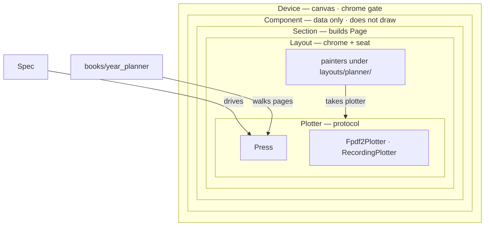

# parch

fpdf2 / Nomad planner on this branch.

parch generates **fixed e-ink PDF pages**. The MVP target is SuperNote Nomad only.

Python 3.14+ required (language features, not just the pin).

## Architecture

```
Device → Component (data only) → Section (build Page) → Layout (chrome + seat) → Plotter → Press
```



Painters live under `layouts/planner/` and take `plotter: Plotter`. Components do not draw. The only plotter backend is `Fpdf2Plotter`. Tests use `RecordingPlotter`.

```
src/parch/
  press.py spec.py
  calendar/
  components/
  sections/
  layouts/planner/
  plotter/{protocol.py,fpdf2.py,recording.py}
  devices/nomad.py
  books/year_planner.py
```

### Device

From `src/parch/devices/nomad.py` (`NOMAD`). Toolbar slab is reserved — not a writing well.

| Device | id | size | resolution | notes |
| --- | --- | --- | --- | --- |
| SuperNote Nomad | `supernote-nomad` | 118.87 × 158.5 mm | 1404×1872 @ 300 PPI | top toolbar 8 mm reserved; writing clearance 4 mm; `root_body` 8.5pt |

## Press the MVP

Needs [uv](https://docs.astral.sh/uv/) and Python 3.14+.

```shell
uv sync --group dev
uv run parch press examples/mvp.toml -o artifacts/mvp/nomad-2026.pdf
# or
uv run python -m parch press supernote-nomad -o parch.pdf
# Specimen catalog (PNG previews under out/specimens/; not a product PDF):
uv run parch specimen supernote-nomad -w out
# ProofProfile (on-screen review):
uv run parch proof examples/mvp.toml -o artifacts/mvp/exp-typeramp-proof.pdf
# or: parch press examples/mvp.toml --proof -o …
```

Default spec is year 2026, Monday week start, **full year** (Jan–Dec). `YearPlanner` walks cover → annual → `ProjectsSection` (`paint_projects_index` + `paint_project`) → `MeetingSection` (`paint_meetings_index` + `paint_meeting`) → `TasksSection` (`paint_tasks_index` + `paint_task`) → `ReviewSection` (`paint_review_index` + `paint_review`) → `QuarterSection` (`paint_quarter`) → each month **plus its habit tracker** → each ISO week that touches the year (once) → that week’s pressed days + `notes_pages` wells. `ProjectsIndex` dests are `projects-index-{year}-{nn}` (Proj lands on `-01`). `[projects] index_pages` is the count of index pages (default 1; MVP sample is 3). `[projects] tickets` is rows per index page (6–10, default 8 — Nomad ticket seating). Dest count is `Spec.project_count` = `index_pages × tickets` (one row → one `projects-{year}-{n:02d}`). Each index page lists its slice (page 1: 01–K, page 2: K+1…). Stub + each preview card link to that row’s `paint_project` well; write-in and strip stay unlinkable. Dest header chip is the global slot number and returns to the **owning** index page; lit **Proj** on a dest does the same. Optional `[projects] cards` (2–4, default 3) and `tasks` (3–6, default 4). `paint_quarter` / `quarter_seats`: short year-density three minis, then content-height Focus over flex Notes. Bottom nav is Year · Quar · Mon · Habit · Week · **Rev** · Day · Notes · **Proj** · **Meet** · **Task**. Habit lands on that context’s month tracker. A month header **Habits** chip is a shortcut to the same page. DAY/NOTES land on the current day (daily/notes), the first pressed day of a week, the 1st of a month, or Jan 1 from the year page — not a press-time “today”. All twelve months’ days and headers are linked. `examples/mvp.toml` uses `notes_pages = 1` to keep the artifact smaller; `2` still works. Optional `[habits] columns = 10`.

Committed proof: [`artifacts/mvp/nomad-2026.pdf`](artifacts/mvp/nomad-2026.pdf) (2026) and sample PNG previews (annual, projects index, quarters, July month, July habits, week, daily, notes). `paint_projects_index` p1: [`artifacts/mvp/exp-projects-index-l-tickets.png`](artifacts/mvp/exp-projects-index-l-tickets.png). Index p2: [`artifacts/mvp/exp-projects-index-l-tickets-p2.png`](artifacts/mvp/exp-projects-index-l-tickets-p2.png). Dest (`paint_project`): [`artifacts/mvp/exp-projects-index-l-leaf.png`](artifacts/mvp/exp-projects-index-l-leaf.png).

`paint_tasks_index` + `paint_task` (in the year walk, after Meetings): month-banded Tasks index + weekly dest. **Task** tab → index; dest header chip is the ISO week and returns to the owning quarter index. Proof: [`artifacts/mvp/exp-tasks-index-c-months.png`](artifacts/mvp/exp-tasks-index-c-months.png) and [`artifacts/mvp/exp-tasks-index-c-dest.png`](artifacts/mvp/exp-tasks-index-c-dest.png).

`paint_review_index` + `paint_review` (in the year walk, after Tasks): multi-column Review week-chip grid + weekly dest (Mon–Sun mini-write strip over unlabeled week narrative). Month headers sit on the left; hairlines span the well so months read across. **Rev** tab → year index; dest header chip is the ISO week and returns to the index. Dest `review-index-{year}` / `review-{iso_year}-W{nn}`. Proof: [`artifacts/mvp/exp-review-index-b.png`](artifacts/mvp/exp-review-index-b.png) and [`artifacts/mvp/exp-review-dest-e.png`](artifacts/mvp/exp-review-dest-e.png).

```shell
uv run pytest
```

## Releasing

Ship steps live in [Releasing](RELEASING.md). Hero planner PDFs attach from `release-pdfs.yml` (not Pages, not a PyPI gate).

## License / Credits

MIT — see [LICENSE](LICENSE).

Historical inspiration: [Vitaliy Kudryk’s LYP](https://github.com/kudrykv/latex-yearly-planner). This branch is an fpdf2 Plotter rewrite; it is not a port of LYP sources.

Runtime dependency [fpdf2](https://github.com/py-pdf/fpdf2) is LGPL-3.0, separate from this MIT license.

Vendored [Jost](https://indestructibletype.com/Jost.html) (Book / Medium / Bold / Heavy) is SIL OFL 1.1 — see `src/parch/fonts/LICENSE`. Weights stay curated. Painters pass a frozen `TypeRef` (`TypeStep` + optional emphasis) or `TypeInk`; `Plotter.text` takes `ink=` or `ref=` resolved through the bound ramp on a closed TypeStep scale (`display` / `title` / `eyebrow` / `body` / `chrome` / `label` / `caption` / `micro` × optional emphasis). Ratio-driven sizes are `root_body ×` em (`Device.root_body`, Nomad 8.5pt); `display` stays fixed 42pt. Overlay size is an absolute override for that step — it does not change root or sibling steps. Press TOML `[typography.overlay.<step>]` parses to that overlay and merges `defaults ⊕ toml ⊕ proof` after `require_overlay` (exact `schema_version`, closed TypeSteps, Jost weights, size bands) — fail before paint. Side example: `examples/mvp-typo-overlay.toml`. `parch proof` / `press --proof` / `press(..., proof=True)` stacks **ProofProfile** (`chrome`/`title`/`eyebrow` +~2pt; `display` unchanged) after toml. `family="jost"` stays on the ink.
