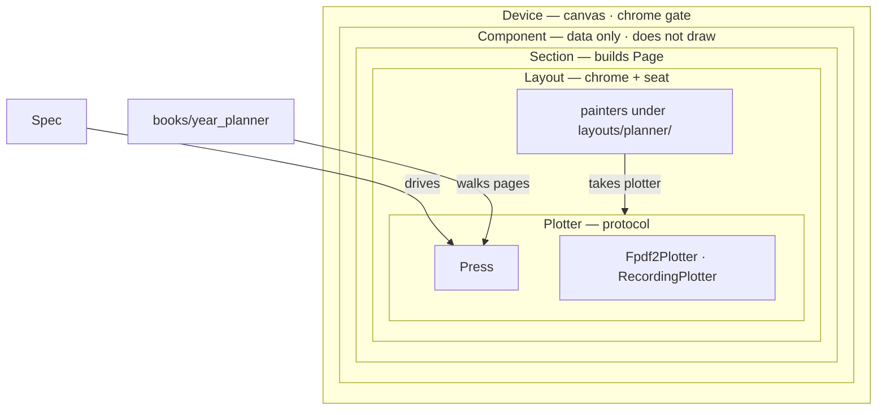

# parch

[](https://pypi.org/project/parch/)
[](https://www.python.org/downloads/)
[](https://github.com/yyolk/parch/actions/workflows/ci.yml)
[](LICENSE)

parch generates **fixed e-ink PDF pages**. The MVP target is SuperNote Nomad only.

Python 3.14+ required (language features, not just the pin).

## Install / Press

Needs [uv](https://docs.astral.sh/uv/) and Python 3.14+.

```shell
uv sync --group dev
uv run parch press examples/mvp.toml -o out/nomad-2026.pdf
# or
uv run python -m parch press supernote-nomad -o parch.pdf
# Specimen catalog (PNG previews under out/specimens/; click a thumb to
# expand in place via CSS. Not a product PDF):
uv run parch specimen supernote-nomad -w out
# ProofProfile (on-screen review):
uv run parch proof examples/mvp.toml -o out/exp-typeramp-proof.pdf
# or: parch press examples/mvp.toml --proof -o …
```

Default `examples/mvp.toml` is full-year 2026, Monday week start, `notes_pages=1`.

## Architecture

```
Device → Component (data only) → Section (build Page) → Layout (chrome + seat) → Plotter → Press
```



Painters live under `layouts/planner/` and take `plotter: Plotter`. Components do not draw. The only plotter backend is `Fpdf2Plotter`. Tests use `RecordingPlotter`.

```
src/parch/
  press.py spec.py
  calendar/
  components/
  sections/
  layouts/planner/
  plotter/{protocol.py,fpdf2.py,recording.py}
  devices/nomad.py
  books/year_planner.py
```

### Device

From `src/parch/devices/nomad.py` (`NOMAD`). Toolbar slab is reserved — not a writing well.

| Device | id | size | resolution | notes |
| --- | --- | --- | --- | --- |
| SuperNote Nomad | `supernote-nomad` | 118.87 × 158.5 mm | 1404×1872 @ 300 PPI | top toolbar 8 mm reserved; writing clearance 4 mm; `root_body` 8.5pt |

## Tests

```shell
uv run pytest
```

## Releasing

Ship steps live in [Releasing](RELEASING.md).

## License / Credits

MIT — see [LICENSE](LICENSE).

Historical inspiration: [Vitaliy Kudryk’s LYP](https://github.com/kudrykv/latex-yearly-planner). This branch is an fpdf2 Plotter rewrite; it is not a port of LYP sources.

Runtime dependency [fpdf2](https://github.com/py-pdf/fpdf2) is LGPL-3.0, separate from this MIT license.

Vendored [Jost](https://indestructibletype.com/Jost.html) (Book / Medium / Bold / Heavy) is SIL OFL 1.1 — see `src/parch/fonts/LICENSE`.
